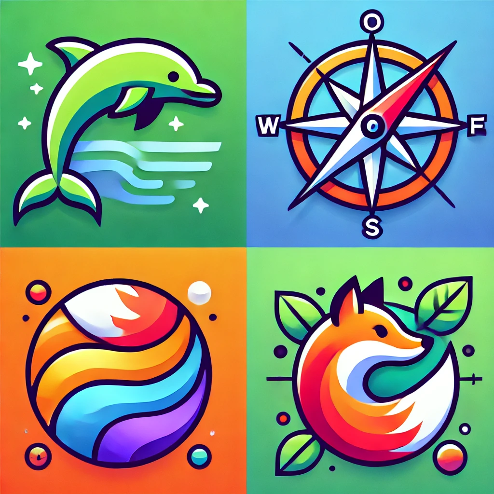

# browsers.party

## What is this?

browsers.party is a website that shows you all the browsers you could use, with info about each of them.

## Browser X is missing!

If you notice a browser is missing, please open an issue or a PR, providing a link to a page where the browser is available.

## Where is the data?

It's all in the repo here, in the [public/db.csv](./public/db.csv) file.

## How can I help?

We are in need of prettifying the website. If you have any ideas, please open up a PR or talk to me on Twitter/X, [@pvinis](https://twitter.com/pvinis).

## Sources

Initial sources:
- https://browser-update.org/browsers.html
- https://github.com/alrra/browser-logos/blob/main/src/README.md
- https://en.wikipedia.org/wiki/List_of_web_browsers
- my own research
